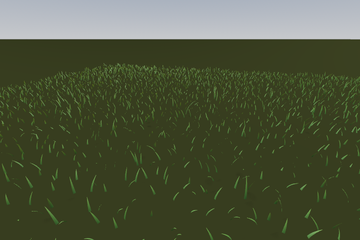
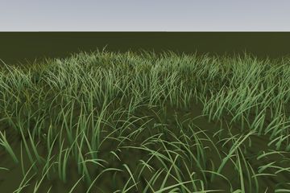
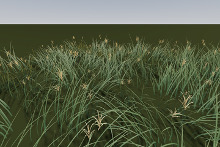
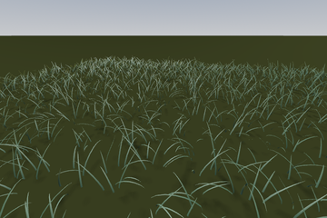
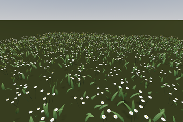

# Waailand

GPU grass, flowers and seasons for [Terrain3D](https://github.com/TokisanGames/Terrain3D), for Godot 4.

| | | | | |
|---|---|---|---|---|
|  |  |  |  |  |

<!-- A screenshot of the grass on a terrain goes here: the editor preview or the game, wide, in good light. -->

Every frame a compute shader turns the grid cells around the camera into grass blades, from the terrain under them
and a painted grass map, so nothing per blade runs on the CPU. Species come in packs and grow by the terrain texture
under them; flowers, plumes and corals grow on their host species and bloom through the year. The grass leans with
the wind, lies down under tyres and feet, is laid flat by a rotor's downwash, sways with the sea's swell under water,
and past the blades a far field in the terrain shader carries the carpet to the horizon. A game can ask what grows at
any point, for footsteps and tyre effects.

## Requirements

- Godot 4.8 (tested on 4.8.dev6).
- Terrain3D 1.1 (tested on 1.1.0-dev, the upstream main branch at 188873b; a Terrain3D build with streaming also works).
- The Forward+ renderer: the grass is placed by compute shaders, which the Compatibility renderer cannot run (the
  Mobile renderer is untested).
- Optional: [Terrain3D Extended](https://github.com/Niekvdm/godot-terrain3d-extended), the editing overlay, for
  painting the grass.

## Install

1. Put the addon at `addons/waailand`: from the Asset Library, as a copy of this repository, or as a git
   submodule.
2. Enable **Waailand** in Project Settings, Plugins.
3. Terrain3D must be installed and working first.

## Quick start

1. Create a `GrassBladesConfig` resource at `res://waailand_config.tres` (or elsewhere, and name its path in the
   project setting `waailand/config_path`). Leave its `packs` empty for now: with no pack in use, the grass grows
   the built-in starter pack.
2. Add a `GrassBlades` node as a child of your `Terrain3D` node (it finds the terrain up its parent chain; or set its
   `terrain`).
3. The grass grows at once, in the editor (a preview on the editor's camera) and in the game.

The starter pack holds lawn, meadow (the fallback: what grows where nothing else is chosen), tall grass with seed
plumes, tufts, and daisies. Until you add ground rules or a growth table, every ground that allows grass grows the
pack's default mix: meadow and lawn, 60 to 40.

## The far field in your terrain shader

Past the blades, the terrain shader draws the carpet: its measured brightness, its grain and the canopy's light, on
the terrain texture's own colour. This needs three additions to a shader made from Terrain3D's (Terrain3D material,
Shader Override); without them the blades still grow and only the carpet past them is missing.

Above the functions, include the wind and the far field:

```glsl
#include "res://addons/waailand/grass_wind.gdshaderinc"
#include "res://addons/waailand/grass_far.gdshaderinc"
```

In `fragment()`, keep the bilinear weights before the height blend reassigns them:

```glsl
vec4 grass_w = weights;   // the grass far field's bilinear weights (weights is reassigned below)
```

Then, before `ALBEDO` is written, let the far field scale the albedo and add its glow:

```glsl
vec3 grass_glow = vec3(0.0);
if (grass_far_enabled) {
	albedo_height.rgb = grass_far_apply(index[0], index[1], index[2], index[3], grass_w, v_vertex,
		v_camera_pos, VIEW, VIEW_MATRIX, NORMAL, albedo_height.rgb, grass_glow);
}
// ... ALBEDO = ...
BACKLIGHT = grass_glow;
```

`GrassBlades` switches `grass_far_enabled` on while it runs (its `far_field` export) and feeds every uniform.

**The grain** is a bake of the carpet photographed from above, per species, read from the config's `far_grain_dir`
(`GrassFarGrain`). This addon ships no baker for it: without a bake the far field draws the carpet's brightness and
light without grain (a bake made for other species is reported with a warning and not used).

## Species packs

- A **species** is a `GrassSpecies` resource: the blade (height, width, clumping, tilt, bend, outline), its colours
  (two base and two tip colours, and a seasonal accent), its height through the year, the sea depth it grows at, beds,
  and the decorations it hosts. Every property has a tooltip.
- A **decoration** is a `GrassDecoration`: a flower, plume, spike or coral that grows among its host species, with
  its placement, bloom dates, palette and mesh. The mesh comes from a builder: a built-in one (lily, freesia,
  chrysanthemum heads, spider lily, plume, spike, coral), `MeshMeshBuilder` for any mesh of your own, or your own
  script extending `GrassDecorationMeshBuilder`.
- A **pack** is a `GrassSpeciesPack`: its species, the fallback species (grown where a mix cannot grow, along road
  verges and for a stray index), and the default mix (what a ground with no rule grows). List packs in the config's
  `packs`, or install them as pack addons (below); species ids must be unique across every pack in use.

**Pack addons.** A pack can be an addon of its own: a folder in `res://addons/` with a `waailand_pack.tres` (the
`GrassSpeciesPack`) at its root and its species, meshes and pictures beside it. Install it by dropping the folder in
(from the Asset Library, as a copy or as a git submodule); there is no plugin to enable. The packs in use are the
config's `packs` first, then every pack addon, sorted by folder, less the config's `disabled_packs` (their `res://`
paths); when none is left, the starter pack, which can be disabled too. `GrassBladesConfig.resolved_packs()` returns
them.

To make a species, duplicate one, change it and add it to a pack. Each species gets a permanent slot the grass maps
store, kept in the project's slot table (`slots_path`, written by the editor), so painted grass never turns into
another species.

**Pictures.** The Grass library shows each species' picture from its pack's `pictures/` folder. Select a pack in the
FileSystem dock: the inspector lists the missing and stale pictures, and **Render missing and stale pictures**
draws them in a separate window with the real shaders. From a shell:

```
godot --path <project> res://addons/waailand/tools/render_pictures.tscn -- --pack res://path/to/pack.tres --stale
```

## What grows where

The terrain decides by default. The **growth table** (a JSON file, the config's `growth_path`) says, per Terrain3D
texture name, how much grass the ground allows (0 to 1) and which species grow there (a mix, and optionally another
mix above an elevation). Repainting the terrain moves the grass with it.

A map can have its own **ground rules**, edited in the **Ground rules** dialog (the Grass workspace's panel, "Ground
rules…"): rules that group surfaces and give each group its own grass on or off, density, species mix and elevation
band; per-species season settings; and the map's date. They are saved per map scene as
`<grounds_dir>/<scene name>.json`.

## Painting

With Terrain3D Extended installed, the plugin adds a **Grass** workspace: Species, Erase (back to the ground's
species), Remove (no grass at all), Density, Height, Smooth, Force (grow whatever the ground), Replace (swap one
painted species for another), Reset (back to the ground's rule) and Pick (take the species under the cursor); ctrl
inverts a tool. The panel holds the species library with pictures and hover cards, the slope and elevation limits, a
region fill, and the preview's date. Each stroke is one undo step; the maps are saved with the scene, one image per
region beside Terrain3D's region files.

The 3D toolbar's **Grass** menu shows or hides the preview, grows it on every ground (to see what a species would
look like anywhere), and sets the date the preview shows.

## Feeding the grass

A game gives the grass its inputs through the `GrassBlades` node.

- State (a later call replaces an earlier one): `set_wind(direction, speed_m_s, instant := false)`,
  `set_date(day_of_year)`, `set_weather(wetness, snow)`, `set_sun(direction)`, `set_sea(level, swell)`,
  `set_ruts(texture, origin, size_m, full_depth)`, `set_road_footprint(footprint)`, `apply_quality(tier)`.
- Events (they add up within a frame and clear with it): `add_crush(from, to, radius, strength, direction)` (a tyre
  lays the grass down), `add_push(from, to, radius, strength, direction)` (a body bends it away),
  `add_wash(position, radius, intensity)` (a rotor's downwash; the frame's two strongest count).
- Read back: `get_day_of_year()`, `get_sea_level()`, `get_swell()`.

The tidy way is a **feeder**: a node that extends `GrassFeeder` and overrides `_feed(dt)`. It runs just before its
parent `GrassBlades` every frame:

```gdscript
extends GrassFeeder
## A steady westerly at midsummer, and the player pushing the grass.

func _feed(_dt: float) -> void:
	blades.set_wind(Vector2(1.0, 0.0), 5.0)
	blades.set_date(171.0)                      # 21 June
	var p := get_tree().get_first_node_in_group(&"player") as Node3D
	if p != null:
		blades.add_push(p.global_position, p.global_position, 0.4)
```

Put a feeder under the `GrassBlades` in your scene, or list its script in the config's `runtime_inputs` (the game) or
`editor_inputs` (the game and the editor preview; such a script needs `@tool`). `GrassGroupStamper`
(`feeders/grass_group_stamper.gd`) is ready-made: every node in a group pushes (or crushes) the grass along its trail
while it is near the ground. Code that is not a feeder finds the grass with `GrassBlades.active()`.

## Reading the grass

`GrassBlades.active().sample(position)` says what grows at a point on the ground, as the GPU decides it there: a
`GrassSample` with `species`, `density`, `height_m`, `colour`, `flower`, `flower_colour`, `forced`, `on_road` and
`pending`. Call it when something happens (a footstep, a slipping wheel), not every frame for every object. In the
game the grass keeps a small cache of region maps for it, read on a worker thread; a point in a region still loading
reads as unpainted and says `pending`.

## Seasons, the sea, roads and downwash

- **Seasons.** `set_date(day)` (0 is 1 January) moves every species through its year: accent colours, heights,
  flowers in bud, bloom and seed. The ground rules can pin a species to a stage or a date.
- **The sea.** `set_sea(level, swell)`: species with a depth range grow below the sea (seagrass, corals), land
  species stop at the waterline, and under water the swell's surge moves the plants instead of the wind.
- **Roads.** `set_road_footprint(footprint)` takes any object with `is_empty() -> bool` and
  `snapshot(origin: Vector2, window: float, pad: float) -> {segs: PackedFloat32Array, polys: Array}` (segments of
  `GrassRoads.SEG_STRIDE` floats: ax, az, bx, bz, half width, flags; polygons as `PackedVector2Array` rings). The road
  surface grows nothing and its verge grows the fallback species, live: a moved road needs no bake.
- **Downwash.** Up to two rotors lay the blades and decorations over about their roots. The wash's profile is
  `grass_downwash.gdshaderinc`; your other shaders (trees, water) can include it so everything moves in step.

## For tools and tests

`wind` (`GrassWindState`) and `interaction` (`GrassInteractionField`) are public objects, the advanced layer: a tool
may read their uniforms or still the grass at once with `wind.calm()`. The members whose doc comments begin "For
tools and tests" (`frozen`, `force_bin`, `force_morph`, `force_yaw`, `force_editor`, `all_grounds`, `types`,
`decorations`, `farfield`, `step()`, `readback()`, `decode()` and others) exist for tools, tests and debugging; a game
has no use for them.

## How it works

- **Placement.** The world is a grid (`grid_pitch`, 0.1 m by default) and a blade IS its grid cell: at most one
  blade grows in a cell, decided by a pure function of its position, so moving the camera never reshuffles the field.
  The compute pass tests every cell within `radius` of the camera against the terrain, the grass map, the ground
  rules, the roads and the slope, picks a species, and writes the survivors into indirect MultiMeshes.
- **Levels of detail.** Near the camera blades are HIGH meshes; from `d_morph` they morph toward the LOW shape and
  switch at `d_switch`; past that the field thins (keeping `k_lo`, then `k_far` in the far carpet) while the
  survivors widen to keep the coverage. A blade grows in or shrinks away over `grow_m` of camera travel, so none
  pops. Shadows are off by default (`shadow_mode`): either a thinned, wider set near the camera casts them, or the
  HIGH blades themselves.
- **Clumps.** Blades gather into Voronoi clumps that share height, facing and colour, which is what makes a field
  read as tussocks instead of noise.
- **The grass maps.** Painting writes one RGBA8 image per terrain region (density, species override, height, force),
  stored beside Terrain3D's own region files and read by the compute on the GPU.
- **Further reading.** The blade design follows Sucker Punch's GDC talk "Procedural Grass in Ghost of Tsushima".

## Tests

The addon's unit suites run in any project that has the addon and Terrain3D installed:

```
godot --headless --path <project> --script res://addons/waailand/tests/run_all.gd
```

It prints a line per suite and exits with the number of failing suites.

## License

MIT, Copyright (c) 2026 Digitzone. See [LICENSE](LICENSE).
